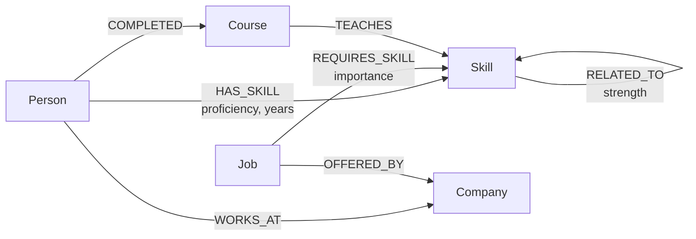

# SkillPath

A graph-backed career pathway explorer, built on **CognoDB**.

Give SkillPath a person and a job they want, and it charts the graph route
between the two: which required skills they already have, which are
missing, which courses close the gap fastest, and — when no course exists
yet — the shortest chain of related skills that gets there anyway. It also
surfaces mentors (people who already hold everything the role needs) and a
navigable map of how every skill in the organization relates to every
other one.

---

## Why a graph database?

Career growth is a network problem wearing a table's clothes. A person's
readiness for a role depends on chains of relationships — skills they
hold, skills the role needs, skills those skills are commonly learned
alongside, courses that teach them, people who've already made the jump —
and the interesting questions are about how those chains connect, not
about any single row.

Concretely, three things this app needs are awkward or slow in a
relational schema and natural in a graph:

1. **Skill-gap matching is a set difference across two many-to-many
   relationships** (`Person`–`Skill`, `Job`–`Skill`). In SQL that's two
   joins plus a `NOT IN` subquery per person/job pair, and it gets worse
   the moment you want to rank *partial* matches (candidates who have 6 of
   8 required skills) — that's a `GROUP BY` with a `HAVING`-style division,
   repeated for every job. In Cypher it's one traversal:
   `(Job)-[:REQUIRES_SKILL]->(Skill)<-[:HAS_SKILL]-(Person)`.

2. **"What should I learn next to bridge this gap?" is a variable-length
   path query.** When no course directly teaches a missing skill, SkillPath
   finds the shortest chain through skills the person already knows via
   `RELATED_TO` edges — `shortestPath((known)-[:RELATED_TO*1..4]-(target))`.
   The relational equivalent is a recursive CTE with a depth cap, which
   most teams reach for a graph database specifically to avoid writing.

3. **The relationships themselves carry meaning that would otherwise live
   in junction tables with no identity of their own** — `HAS_SKILL` carries
   proficiency and years, `REQUIRES_SKILL` carries importance, `RELATED_TO`
   carries a relatedness strength. Cypher pattern-matches over these
   properties as naturally as node properties; SQL needs a join to a
   bridge table every time you want to touch one.

None of this is impossible in Postgres — it's that every one of these
queries would need hand-written recursive SQL or an ORM workaround, where
here it's the direct, obvious way to ask the question.

---

## Data model



**Nodes**

| Label | Key properties |
|---|---|
| `Person` | `id`, `name`, `title`, `bio` |
| `Skill` | `id`, `name`, `category` |
| `Job` | `id`, `title`, `level`, `description` |
| `Company` | `id`, `name`, `industry` |
| `Course` | `id`, `title`, `provider`, `url`, `duration_hours` |

**Relationships**

| Type | Direction | Properties |
|---|---|---|
| `HAS_SKILL` | `Person → Skill` | `proficiency`, `years` |
| `REQUIRES_SKILL` | `Job → Skill` | `importance` (1–3) |
| `RELATED_TO` | `Skill → Skill` | `strength` (1–5) |
| `TEACHES` | `Course → Skill` | — |
| `WORKS_AT` | `Person → Company` | — |
| `OFFERED_BY` | `Job → Company` | — |
| `COMPLETED` | `Person → Course` | — |

Seed size: 32 skills, ~38 skill relations, 8 companies, 15 jobs, 22
people, 14 courses — comfortably inside a CognoDB free (c0) instance.

---

## Project structure

```
skillpath/
├── backend/                 Express API (Node, ESM)
│   ├── src/
│   │   ├── db/driver.js     CognoDB connection, query runner, error normalization
│   │   ├── db/serialize.js  Neo4j driver types → plain JSON
│   │   ├── routes/          One file per resource (people, jobs, skills, courses, pathway, health, stats)
│   │   └── server.js        Express app, central error handler
│   ├── seed/
│   │   ├── data.js          All seed data, in one place
│   │   └── seed.js          Wipes + loads the graph via parameterized Cypher
│   └── .env.example
└── frontend/                 React + Vite + Tailwind
    └── src/
        ├── pages/            Overview, People, Jobs, Skill Map, Pathway
        ├── components/       NavBar, ConstellationGraph (the skill-map visualization), States
        └── lib/               api.js (fetch client), useAsync.js (data-fetching hook)
```

---

## Setup

### 1. Create your CognoDB instance

1. Sign up at [console.cognodb.com](https://console.cognodb.com/signup) (free tier, no card).
2. Create a free `c0` instance and pick a region.
3. **Save the connection URI, username, and password immediately** — the
   password is shown once.

### 2. Backend

```bash
cd backend
npm install
cp .env.example .env   # then fill in COGNODB_URI and COGNODB_PASSWORD
npm run seed            # wipes and loads the graph
npm start                # http://localhost:4000
```

`GET /api/health` reports whether the API can currently reach CognoDB —
useful for confirming your `.env` is correct before touching the UI.

### 3. Frontend

```bash
cd frontend
npm install
cp .env.example .env   # VITE_API_URL, defaults to http://localhost:4000/api
npm run dev              # http://localhost:5173
```

### 4. Production build (for hosting)

```bash
cd frontend && npm run build   # outputs frontend/dist — deploy as a static site
cd backend  && npm start        # deploy as a Node service; set env vars in your host's dashboard
```

Any static host (Vercel, Netlify, Cloudflare Pages) works for the
frontend; any Node host (Render, Railway, Fly.io) works for the backend.
Point `VITE_API_URL` at wherever the backend ends up.

---

## The main queries, explained

**Skill gap** (`GET /api/pathway`) — everything a job requires, tagged
with whether the chosen person already has it:

```cypher
MATCH (p:Person {id: $personId})
OPTIONAL MATCH (p)-[:HAS_SKILL]->(known:Skill)
WITH p, collect(known.id) AS knownIds
MATCH (j:Job {id: $jobId})-[r:REQUIRES_SKILL]->(req:Skill)
RETURN req.id AS id, req.name AS name, r.importance AS importance,
       req.id IN knownIds AS alreadyHeld
ORDER BY r.importance DESC
```

**Learning route for an uncovered gap skill** — the variable-length,
relationally-awkward one. Finds the shortest chain of related skills from
anything the person already knows to the skill they're missing:

```cypher
MATCH (p:Person {id: $personId})-[:HAS_SKILL]->(known:Skill)
MATCH (target:Skill {id: $targetId})
MATCH path = shortestPath((known)-[:RELATED_TO*1..4]-(target))
RETURN [n IN nodes(path) | {id: n.id, name: n.name}] AS steps, length(path) AS hops
```

**Ranked candidate matching for a job** — a multi-hop traversal (2 hops:
`Job → Skill → Person`) with an aggregate ranking that would need a
self-join and a computed column in SQL:

```cypher
MATCH (j:Job {id: $id})-[:REQUIRES_SKILL]->(allReq:Skill)
WITH j, count(DISTINCT allReq) AS totalRequired
MATCH (j)-[:REQUIRES_SKILL]->(req:Skill)<-[:HAS_SKILL]-(p:Person)
WITH p, totalRequired, count(DISTINCT req) AS matched
RETURN p, matched, totalRequired, round(100.0 * matched / totalRequired) AS matchPercent
ORDER BY matchPercent DESC LIMIT 10
```

All queries are parameterized (`$personId`, `$jobId`, etc.) via the
official `neo4j-driver` — no string-concatenated Cypher anywhere in the
codebase.

---

## Engineering notes

- **Secrets**: `COGNODB_URI`/`COGNODB_PASSWORD` are read from environment
  variables in `backend/.env`, which is git-ignored. Nothing is
  hard-coded.
- **Error handling**: if CognoDB is unreachable, every route returns a
  clean `503` with a human-readable message (see `backend/src/server.js`'s
  central error handler and `backend/src/db/driver.js`) instead of
  crashing or leaking a stack trace. The frontend surfaces this as a
  retry-able error state rather than a blank page.
- **Serialization**: `backend/src/db/serialize.js` converts the Neo4j
  driver's `Node`/`Relationship`/`Integer` wrapper types into plain JSON
  recursively, so route handlers never leak driver internals to the
  client.

---


